# Hawk-Eye — Comprehensive Project Handbook

<div align="center">

**Local-first machine-learning pipeline for network-intrusion–style detection**

*Designed for reproducibility, Apple Silicon (M1/M2) friendliness, and operator-controlled deployment*

</div>

For a **concise stakeholder report** (live network → model → attack vs benign), see **[`docs/PROJECT_CAPABILITY_REPORT.md`](docs/PROJECT_CAPABILITY_REPORT.md)**.

**Quick paths:** [15-minute lab](docs/QUICKSTART_LAB.md) · [Docker operator notes](docs/DOCKER.md) · [Environment variables](docs/ENVIRONMENT.md) · [Sessions & API keys](docs/AUTH_TOKENS.md)

---

## Table of contents

1. [Executive summary](#1-executive-summary)
2. [Visual architecture (diagrams)](#2-visual-architecture-diagrams)
3. [Terminology & glossary](#3-terminology--glossary)
4. [Repository layout & file encyclopedia](#4-repository-layout--file-encyclopedia)
5. [Machine-learning stack (deep dive)](#5-machine-learning-stack-deep-dive)
6. [Autoencoder & anomaly detection](#6-autoencoder--anomaly-detection)
7. [Decision fusion, novel detection & triage](#7-decision-fusion-novel-detection--triage)
8. [Phases, quality gates & QA matrix](#8-phases-quality-gates--qa-matrix)
9. [Backend service (FastAPI)](#9-backend-service-fastapi)
10. [SQLite data model](#10-sqlite-data-model)
11. [HTTP API reference](#11-http-api-reference)
12. [Pydantic request/response schemas](#12-pydantic-requestresponse-schemas)
13. [Results, metrics & interpretation](#13-results-metrics--interpretation)
14. [Quickstart (condensed)](#14-quickstart-condensed)
15. [Deep usage guide (install → API → dashboard → lab)](#15-deep-usage-guide-install--api--dashboard--lab)
16. [Further reading](#16-further-reading)
17. [Appendix: Dataset & pipeline commands (CICIDS)](#appendix-dataset--pipeline-commands-cicids)

---

## 1. Executive summary

**Hawk-Eye** is a research and engineering codebase that:

- **Trains** supervised classifiers (sklearn and/or PyTorch tabular MLPs) on flow-like tabular features (e.g. CICIDS-style datasets).
- **Trains** unsupervised **anomaly** models on **benign-only** traffic (Isolation Forest and/or **autoencoder** reconstruction error).
- **Scores** new rows through **bundles** (versioned directories under `artifacts/`) with strict **feature contracts**.
- **Fuses** supervised probabilities, anomaly scores, and optional **open-set** distances into **operational decision labels** (`KnownAttack`, `AttackUncertain`, `BenignOrLowRisk`) via [`decision_fusion`](src/hawk_eye/decision_fusion.py).
- **Surfaces** analyst workflows through an optional **FastAPI** dashboard backend (SQLite, RBAC, WebSockets, jobs) in [`hawk_eye.backend`](src/hawk_eye/backend/).

Nothing in this repository claims certified “zero-day” detection; novelty paths are **heuristic** and require governance (see [`docs/MODEL_GOVERNANCE.md`](docs/MODEL_GOVERNANCE.md)).

---

## 2. Visual architecture (diagrams)

### 2.1 System context (C4-style)

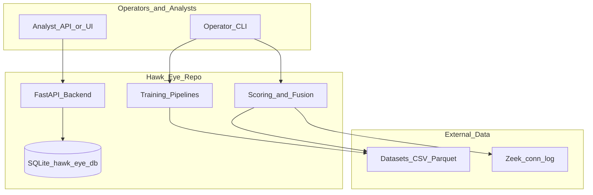

### 2.2 End-to-end ML data flow

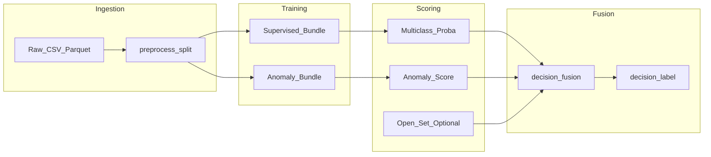

### 2.3 Bundle resolution (scoring)

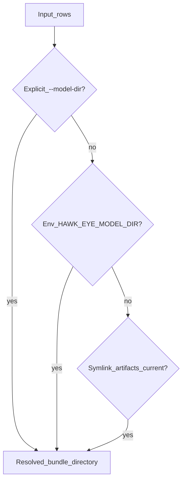

### 2.4 Supervised vs anomaly training split

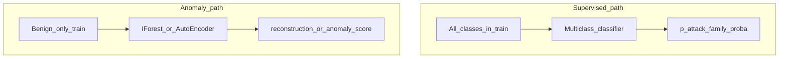

### 2.5 MLP autoencoder structure (conceptual)

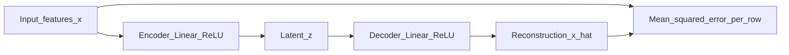

### 2.6 Decision fusion logic (simplified)

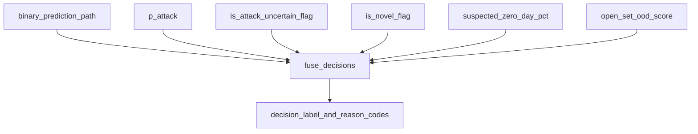

### 2.7 Live dual-mode pipeline (CLI)

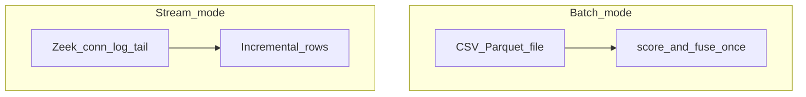

### 2.8 FastAPI backend component map

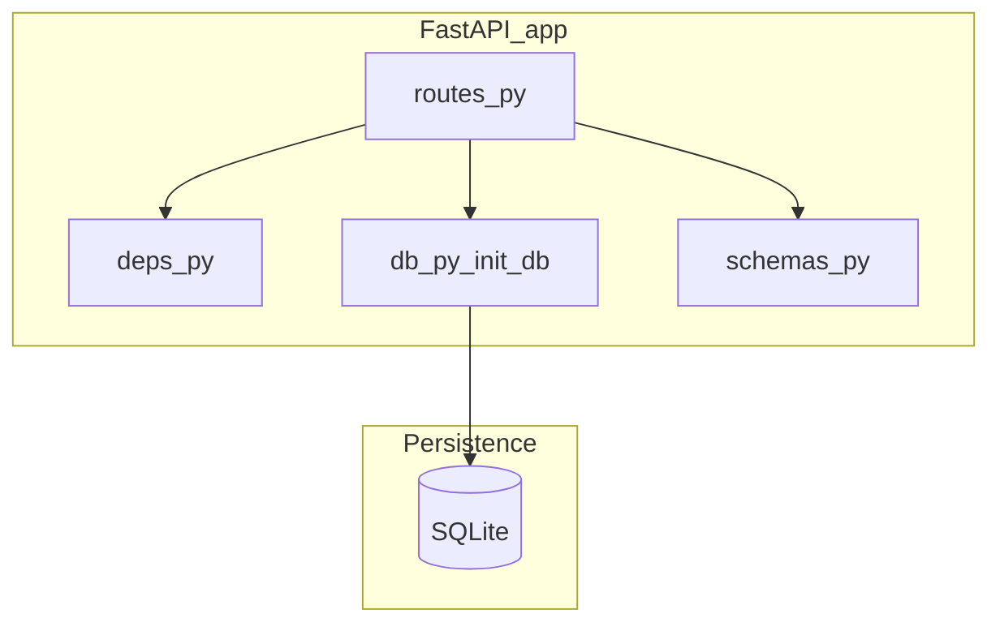

### 2.9 Auth sequence (Bearer login)

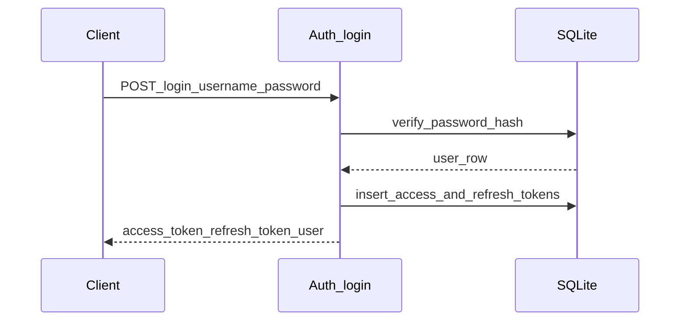

### 2.10 Stream session job lifecycle

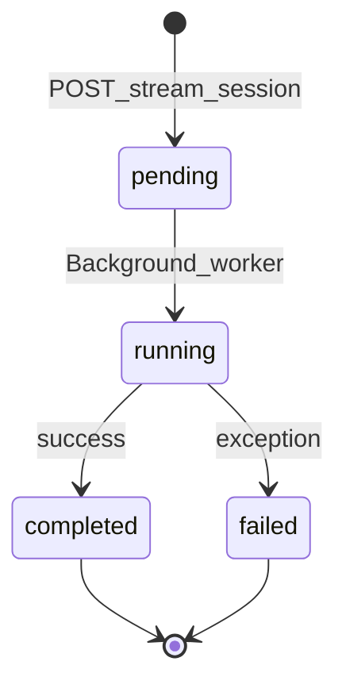

### 2.11 Tenant isolation (non-global admin)

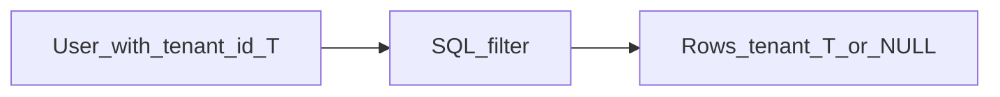

### 2.12 Novelty pipeline (conceptual)

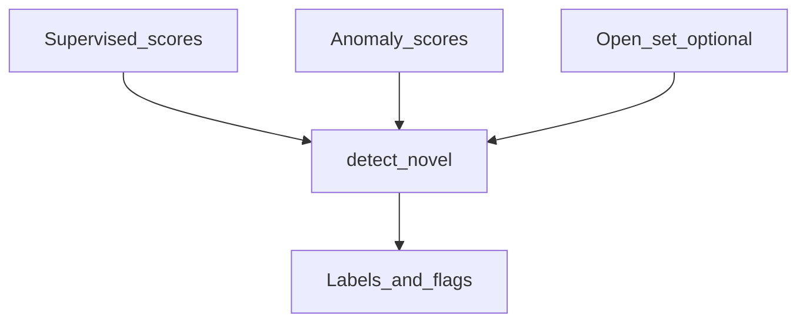

### 2.13 Attack-uncertain heuristic (binary + multiclass + anomaly)

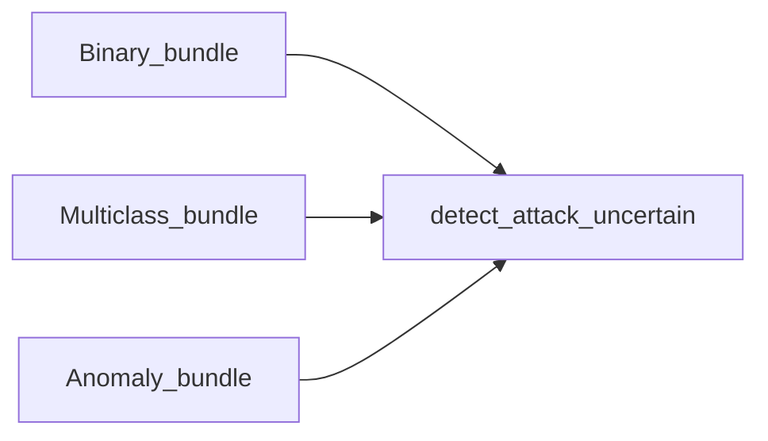

### 2.14 UNSW external profiles (balanced vs high recall)


### 2.15 Test pyramid (repository)

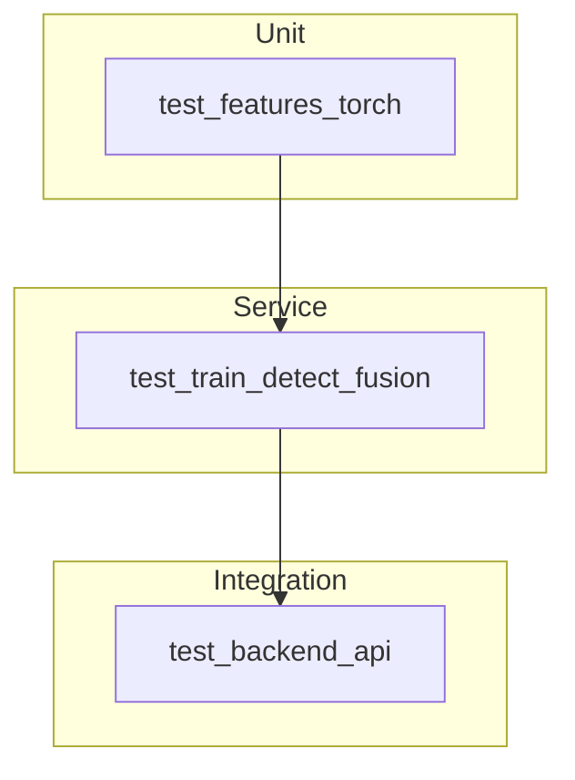

### 2.16 Canonical local run (`run_canonical_local.sh`)

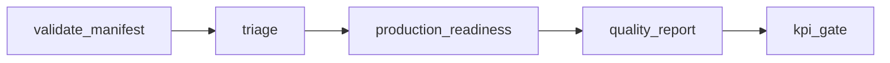

### 2.17 PyTorch tabular training path

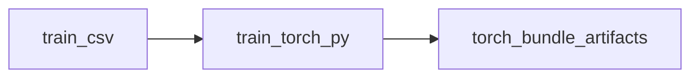

### 2.18 SQLite schema evolution (migrations)

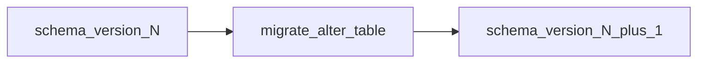

---

## 3. Terminology & glossary

| Term | Meaning |
|------|---------|
| **Bundle** | Versioned directory under `artifacts/` containing model weights, preprocessor, `config.json` / metadata, and **feature column contract**. |
| **Feature contract** | Ordered list of column names the model expects; scoring aligns or rejects mismatched inputs. |
| **Supervised bundle** | Multiclass (or binary-collapsed) classifier trained on labeled attack families + benign. |
| **Anomaly bundle** | Model trained on **benign-only** data (Isolation Forest or autoencoder). |
| **Binary bundle** | Binary classifier (e.g. Benign vs Attack) used in attack-uncertain heuristics. |
| **p_attack** | Calibrated or raw probability / score that traffic is attack-like (definition depends on training path). |
| **Open-set / OOD** | Distance or score vs benign prototypes — “out of distribution” signal (optional). |
| **AttackUncertain** | Operational label: attack-like or novelty-like signal needing analyst review. |
| **KnownAttack** | High-confidence mapping to known attack behavior under fusion rules. |
| **BenignOrLowRisk** | Low-risk path under current thresholds. |
| **Suspected_ZeroDay** | **Label name** for strong novelty suspicion — **not** a verified zero-day CVE. |
| **Fusion thresholds** | JSON knobs (`min_p_attack_known`, `min_szd_uncertain`, `min_open_set_uncertain`) driving `fuse_decisions`. |
| **UNSW profile** | Tuned operating point for external-unknown evaluation (`balanced` vs `high_recall`) in `reports/unsw_external_profiles.json`. |
| **Tenant** | Logical isolation scope in SQLite for multi-tenant dashboard data. |
| **RBAC** | Role-based access: `admin`, `analyst`, `viewer` on API routes. |
| **WAL** | SQLite write-ahead log journal mode for safer concurrent reads. |

---

## 4. Repository layout & file encyclopedia

This section is the **long-form, file-by-file** documentation for the repository: what each file exists for, how it fits into the pipeline, and what operators or developers should know. Paths are relative to the repository root unless stated otherwise. Generated artifacts under `reports/` and `artifacts/` are described as a **category**, not every JSON blob.

### 4.1 Root & packaging

#### `pyproject.toml`

Defines the **Python package** `hawk-eye` for setuptools: build backend (`setuptools.build_meta`), `requires-python >= 3.11`, and **runtime dependencies** (NumPy, pandas, scikit-learn, joblib, pyarrow, torch, FastAPI, uvicorn, pydantic, prometheus-client). Optional extras include **`dev`** (pytest, kaggle, httpx), **`benchmark`** (LightGBM, XGBoost), and **`optuna`**. It sets `package-dir` to `src` and discovers packages under `src`. This file is the **source of truth** for `pip install -e .` metadata; keep versions aligned with reproducibility goals.

#### `requirements.txt`

Companion **pip** lock-style or convenience list used when workflows expect `pip install -r requirements.txt` instead of installing from `pyproject.toml` alone. Operators should prefer one workflow consistently to avoid version skew between environments.

#### `README.md`

Project **entry documentation**: vision, architecture diagrams, glossary, API summary, quickstart, and **this §4 file encyclopedia**. It is the first stop for humans and should stay synchronized with major behavioral changes (auth model, pipeline phases).


### 4.2 `src/hawk_eye/` — core package

#### `__init__.py`

Marks `hawk_eye` as a Python package. May export a public `__version__` or minimal API; most functionality is accessed through **module paths** (e.g. `python -m hawk_eye.train`).

#### `api_service.py`

**ASGI application entry** for production serving: imports `create_app` from `hawk_eye.backend.app` and binds the name `app`. Uvicorn is typically launched as `uvicorn hawk_eye.api_service:app`. This file intentionally stays tiny so the HTTP stack lives under `backend/` and can be tested independently.

#### `bundle.py`

**Supervised model bundle loader**: reads a directory produced by training (serialized sklearn/torch artifacts, preprocessor, `config.json`, feature column lists). It is the **contract enforcement point** between training and scoring—wrong columns or missing files fail fast. Used by `score.py`, `detect_novel.py`, and live paths that need bundle metadata.

#### `io.py`

**Tabular I/O utilities** for CSV and Parquet: reading training/eval tables, writing scored outputs. Centralizes dtype handling and path conventions so every script does not reimplement `pd.read_csv` edge cases. Performance-sensitive paths may use PyArrow where configured.

#### `paths.py`

**Canonical filesystem paths** for artifacts, reports, and default bundle locations. Reduces hard-coded `"artifacts/current"` strings across the codebase and documents expected directory layout for contributors.

#### `preprocess.py`

**Dataset preprocessing entry**: column selection, label handling, and coordination with `split.py`. Often the first transformation after raw CSV ingest; outputs feed `data/processed/` style splits used by `train.py`.

#### `preprocessing_supervised.py`

**Supervised-specific preprocessing** hooks—encoding, scaling steps that must be **identical** at train and score time. Works with the bundle’s stored preprocessor to prevent train/serve skew.

#### `split.py`

**Train/validation/test splitting** logic (random, stratified, or time-aware depending on CLI flags). Correct splitting is critical for honest metrics; time-based splits are emphasized for network traffic to reduce **future leakage**.

#### `features.py`

**Core feature engineering** for generic flow-like tabular data: derives or selects columns expected by the supervised model. Acts as the shared vocabulary between CICIDS-style datasets and internal tensor/sklearn representations.

#### `features_cic.py`

**CICIDS-specific** naming, aliases, and transforms layered on top of `features.py`. Keeps CIC-focused experiments readable without polluting the generic feature module.

#### `cic_normalize.py`

**Normalization and scaling** routines tailored to CIC feature distributions. Used where domain practice requires column-wise standardization or bounds to stabilize training.

#### `train.py`

**Primary sklearn supervised training** CLI: logistic regression, histogram gradient boosting, optional **class weights**, **calibration** (sigmoid/isotonic) with held-out calibration CSV, optional **open-set prototype export**. Writes a **versioned bundle** under `--out` and records metadata (model type, feature list, metrics). This is the workhorse for multiclass intrusion-family classification on tabular flows.

#### `train_torch.py`

**PyTorch tabular MLP training** CLI: uses `torch_tabular` modules, trains with Adam/scheduler patterns appropriate for MLPs on Apple Silicon (MPS) or CUDA/CPU. Produces torch-specific bundles symlinked by shell scripts to `artifacts/current`.

#### `torch_tabular.py`

**Neural network building blocks** for tabular data: MLP definitions, training loops helpers, device selection (MPS/CUDA/CPU). Shared between `train_torch.py` and anomaly autoencoder code paths where architectures overlap conceptually.

#### `supervised_estimators.py`

**Estimator factories** and sklearn-compatible wrappers: centralizes model type switches (`logistic`, `hist_gradient_boosting`, etc.) so `train.py` stays maintainable when adding new baselines.

#### `evaluate.py`

**Standard evaluation CLI** for multiclass models: confusion matrix summaries, macro/micro F1, per-class recall—optimized for **imbalanced** intrusion datasets where accuracy misleads. Outputs JSON reports under `reports/` when invoked from scripts.

#### `evaluate_extended.py`

**Extended evaluation**: rare-class focus, family-level breakdowns, additional tables for research reports. Used when `evaluate.py` summaries are insufficient for publication or KPI narratives.

#### `score.py`

**Batch scoring CLI**: loads a bundle via `bundle.py`, applies the same preprocessing, emits predictions and optional **probability columns** (`--proba-all`, `--proba-max`). This is the main production path for scoring static CSV/Parquet exports from SIEM or offline captures.

#### `labels_binary.py`

**Label collapse utilities**: map multiclass labels to **Benign vs Attack** for binary bundles. Critical for `detect_attack_uncertain.py` and binary calibration experiments documented in `docs/binary_benign_attack.md`.

#### `open_set.py`

**Open-set / OOD scoring** after supervised training: computes distances or scores vs **benign prototypes** exported at train time. Feeds optional columns consumed by `detect_novel.py` and `decision_fusion.py` when enabled.

#### `train_anomaly.py`

**Anomaly training CLI**: Isolation Forest and/or **PyTorch autoencoder** on **benign-only** data. Writes an **anomaly bundle** separate from supervised bundles. Hyperparameters (contamination, latent size, epochs) materially affect FPR/TPR trade-offs—always pair with `evaluate_anomaly.py`.

#### `anomaly_ae.py`

Defines **`MLPAutoEncoder`**: encoder (Linear+ReLU stack) to a latent vector, symmetric decoder, and **`reconstruction_error`** per row (MSE). Trained so benign reconstructs well; high error suggests **novelty** (not necessarily attack). Device selection prefers MPS on Mac.

#### `anomaly_bundle.py`

**Anomaly bundle I/O**: parallel to `bundle.py` but for IForest/AE artifacts and metadata. Ensures anomaly scoring loads the correct model type and feature alignment.

#### `anomaly_score.py`

**Internal scoring helpers** for anomaly models: applies IForest decision function or AE reconstruction error consistently across evaluation and batch scoring code paths.

#### `score_anomaly.py`

**CLI to score** arbitrary feature rows with an anomaly bundle, emitting anomaly scores as columns for downstream fusion or reporting.

#### `evaluate_anomaly.py`

**Evaluate anomaly detectors** on a labeled mix of benign and attack traffic: emphasizes **FPR on benign** vs **TPR on attacks**; avoids naive accuracy when benign dominates.

#### `detect_novel.py`

**Novelty / “zero-day–style” heuristics**: combines supervised probabilities, anomaly scores, optional open-set, and configurable thresholds to assign labels such as `Suspected_ZeroDay`. Explicitly **operational suspicion**, not CVE verification—must be governed (see `docs/MODEL_GOVERNANCE.md`).

#### `detect_attack_uncertain.py`

**Attack-uncertain pipeline**: requires a **binary** bundle plus multiclass + anomaly bundles; computes `is_attack_uncertain` when binary says Attack but multiclass/anomaly patterns suggest **unknown or ambiguous** behavior. Used for analyst triage queues.

#### `decision_fusion.py`

**Core decision fusion**: maps binary prediction, `p_attack`, uncertainty flags, novelty flags, `suspected_zero_day_pct`, optional open-set score into **`decision_label`** (`KnownAttack`, `AttackUncertain`, `BenignOrLowRisk`) and **`reason_codes`**. Thresholds can be loaded from JSON; this module is shared by offline scripts and the FastAPI `/detections/triage` route.

#### `soc_policy.py`

**SOC-style queue tagging** from scores (e.g. suggested priority)—**recommendations only**, not inline blocking. Documents the separation between ML suggestions and enforcement in `docs/runbook.md`.

#### `rag_triage.py`

**RAG-oriented triage helpers** for retrieval-augmented analyst workflows (if used in your deployment). Integrates with scored feature rows and optional text/metadata columns.

#### `explain.py`

**Explanation hooks** for model predictions (e.g. permutation importance, simple attributions) where implemented—used for analyst trust and debugging false positives.

#### `explain_queue.py`

**Batched explanation processing** to avoid blocking hot scoring paths: queues rows for slower explainers.

#### `llm_format.py`

**Optional OpenAI-compatible formatting** of explain JSON (`python -m hawk_eye.llm_format`): turns deterministic `explain` payloads into short analyst prose when `OPENAI_API_KEY` is set; otherwise returns an **offline stub** (CI-safe). See [`docs/llm.md`](docs/llm.md).

#### `novelty_calibrator.py`

**Calibration for novelty-related scores** in UNSW-oriented pipelines: fits/applies calibrators so external-unknown metrics are comparable across runs (see UNSW scripts in `scripts/`).

#### `ops_guardrails.py`

**Operational guardrails**: validates configuration ranges, bundle compatibility, or policy JSON before long runs. Covered by `tests/test_ops_guardrails.py`.

#### `export_benign.py`

**Exports benign-only** rows from processed splits for anomaly training—ensures attack labels never leak into the benign-only training set for novelty models.

#### `redact.py`

**Redaction utilities** for logs/exports (IPs, payloads) when sharing artifacts outside trusted environments—supports compliance narratives in `docs/compliance_retention.md`.


### 4.3 `src/hawk_eye/backend/` — API server

#### `__init__.py`

Exports **`create_app`** as the public factory for the FastAPI application.

#### `app.py`

**FastAPI factory**: registers **lifespan** (calls `init_db` on startup), adds **rate-limit middleware**, includes all routers (health, auth, tenants, detections, alerts, cases, reports, governance, integrations, rules, suppressions, export, jobs, settings, WebSocket). Bumps app **version** string for operators.

#### `routes.py`

**Largest backend module**: defines every HTTP route—**login-only auth** (no public register), token refresh, API keys, SQLite-backed **alerts/cases/rules/suppressions**, **detection score/triage** with fusion settings, **timed stream-session** jobs, **exports**, **GET/PATCH detection settings**, Zeek stream collection enqueue, **Prometheus** metrics, **WebSocket** `/ws/events`. Imports policy evaluation and tenant scoping helpers.

#### `schemas.py`

**Pydantic v2 models** for JSON bodies: login, refresh, API key creation, alerts, cases, rules, suppressions, score requests, detection settings patch, stream session creation, export jobs. Drives OpenAPI schema at `/docs`.

#### `db.py`

**SQLite schema**: `SCHEMA_VERSION`, `init_db()` creates/ migrates tables (`tenants`, `users`, `alerts`, `cases`, `audit_events`, `auth_tokens`, `refresh_tokens`, `api_keys`, `background_jobs`, `detection_settings`, `scored_events`, `stream_job_artifact_index`, timeline/comments/assignments, etc.). Uses **WAL** mode and **foreign keys**. Seeds default **admin** user on first run.

#### `deps.py`

**FastAPI dependencies**: `current_user` resolves **Bearer** token or **`X-API-Key`** hash against SQLite; `require_roles(*roles)` enforces RBAC (`admin`, `analyst`, `viewer`).

#### `tenant_scope.py`

**Tenant isolation helpers**: `is_global_admin`, `tenant_id_for_write`, SQL fragments for filtering rows by `tenant_id` for non-global users.

#### `policies.py`

**Suppression engine** (IP, label, subnet targets) and **rule expression** evaluation for detection rows and alert payloads—used by `/detections/score`, `/detections/triage`, and alert creation.

#### `detection_resolution.py`

Resolves **default artifact directories** and **UNSW fusion kwargs** from `reports/unsw_external_profiles.json` and `reports/thresholds_fusion_selected.json` given the active profile (`balanced` / `high_recall`).

#### `detection_settings_repo.py`

**CRUD merge** for `detection_settings` rows: global defaults (`tenant_id` NULL) plus per-tenant overrides; validates poll intervals and duration defaults.

#### `stream_duration.py`

Parses human durations (`30s`, `1m`, `1h`, `1d`) with **maximum** caps for API safety.

#### `stream_session_job.py`

**Background worker** for `stream_collect` jobs: runs `run_stream_collect_duration` from `live/dual_mode.py`, writes summary JSON, updates `background_jobs` to `completed`/`failed`. **No WebSocket** progress for stream jobs—state is SQLite-only.

#### `jobs_runner.py`

Processes **export** jobs (`export_alerts_csv`, `export_audit_json`) synchronously; writes CSV/JSON under `data/exports/`.

#### `rate_limit.py`

**Sliding-window** per-IP/path rate limit (~120/min); excludes health, metrics, docs, OpenAPI, WebSocket paths.

#### `events.py`

**Async-safe broadcast** helper wrapping `ws_hub` for alert/case events from sync route handlers.

#### `ws_hub.py`

In-memory **WebSocket fan-out** registry for connected clients authenticated with bearer tokens.


### 4.4 `src/hawk_eye/live/`

#### `dual_mode.py`

**Zeek conn.log ingestion** for batch and stream-style scoring: parses tab-separated Zeek logs, maps columns to the **bundle feature contract** via `prepare_input_dataframe`, runs `attack_uncertain_dataframe` + fusion, optional alerts JSONL emission. Exposes **`run_stream_collect_duration`** for API timed collection windows (poll loop + state file offset).

#### `zeek.py`

Additional **Zeek-specific** helpers (parsing edge cases, field helpers) shared with `dual_mode.py`.


### 4.5 `src/hawk_eye/dashboard/`

#### `store.py`

**SQLite insert** helper for batch scoring outputs into the unified `hawk_eye.db` table `scored_events` (used by `scripts/store_results_sqlite.py` and optional analytics).

#### `__init__.py`

Package marker for `hawk_eye.dashboard`.


### 4.6 `scripts/`

Each script is a **CLI entrypoint**; most assume `pip install -e .` and run from repo root.

#### `run_cicids_pipeline.sh`

**End-to-end CICIDS pipeline**: download/split/train/evaluate and symlink `artifacts/current`. Primary onboarding path for new contributors with Kaggle credentials.

#### `run_dual_detection.py`

CLI for **dual-mode detection**: `--mode batch` (CSV/Parquet input) or `--mode stream` (Zeek `conn.log`), invokes `hawk_eye.live.dual_mode` runners, optional webhook posting, summary JSON emission.

#### `run_canonical_local.sh`

**Canonical local validation** orchestrator: manifest validation, triage, production readiness, quality report, KPI gate—referenced from `README` and operator docs.

#### `run_api_service.sh`

Starts **uvicorn** on `hawk_eye.api_service:app` with sensible host/port for local dashboard backends.

#### `validate_run_manifest.py`

Validates **`config/run_manifest*.json`** structure and required fields before long runs; paired with `tests/test_validate_run_manifest.py`. Relative paths in the manifest are resolved from the **repository root** by default; use **`--root`** to override the base directory (e.g. for tests or alternate layouts).

#### `check_production_readiness.py`

Checks artifacts, thresholds, and policy files expected before declaring a run “production ready”; emits `reports/production_readiness.json`.

#### `enforce_kpi_gate.py`

Reads a **scorecard JSON** and **`config/kpi_policy.json`**, writes pass/fail `reports/kpi_gate.json` with exit codes for CI.

#### `build_quality_iteration_report.py`

Aggregates multiple report JSONs into a **quality iteration** summary for human review.

#### `tune_unsw_external_profiles.py`

Sweeps or optimizes **UNSW external-unknown** operating points; writes `reports/unsw_external_profiles.json` (`balanced_profile`, `high_recall_profile`).

#### `run_unsw_profile_pipeline.py`

Runs evaluation/calibration steps for a selected **UNSW profile** (`balanced` or `high_recall`) against scored UNSW parquet inputs.

#### `eval_unsw_unknown.py`

**UNSW unknown-like triage evaluation**: loads a **mapped UNSW** CSV/Parquet (with `Label`), runs `attack_uncertain_dataframe` plus optional **open-set** scoring, then `fuse_decisions` to produce operational labels. Default bundle paths mirror the repo’s UNSW artifact layout (`artifacts/hawk-eye-binary`, `hawk-eye-sup`, `hawk-eye-anomaly-ae-tuned`). Writes **`reports/unsw_unknown_eval.json`** (or `--out`) with metrics on how well unknown-style rows are separated from known families—used when tuning `reports/unsw_external_profiles.json` and scorecards.

#### `eval_unsw_novelty_calibrator.py`

Evaluates **novelty calibrator** fits (from `novelty_calibrator.py` workflows) on UNSW-scored data: reads calibrated vs raw novelty columns, aggregates calibration quality metrics, and emits JSON under `reports/` for comparison across runs. Pair with **`train_unsw_novelty_calibrator.sh`** when you need before/after calibration tables.

#### `train_unsw_novelty_calibrator.sh`

**Shell orchestrator** that fits UNSW-oriented novelty calibrators (invoking Python modules / training steps with pinned artifact paths) and writes calibrator artifacts plus a short summary JSON. Intended for **repeatable** UNSW experiments without hand-typing long `python -m` lines; check the script body for exact env vars and output paths.

#### `build_final_rare_scorecard.py`

Builds **`reports/final_rare_scorecard.json`** from component evaluation outputs for rare-attack analysis.

#### `generate_result_plots.py`

Generates **matplotlib** plots from report JSON (threshold curves, confusion summaries) for documentation and slides.

#### `run_triage_pipeline.sh`

**End-to-end triage shell**: activates the venv, reads processed validation data (`INPUT_PATH` / `data/processed/val.csv` by default), runs **`hawk_eye.detect_attack_uncertain`** into `reports/attack_uncertain_scored.parquet`, optionally chains **open-set** scoring when `open_set_prototypes.npz` exists, then runs **decision fusion** to emit **`reports/triage_scored.parquet`** and summaries. Central to reproducing **KnownAttack / AttackUncertain / BenignOrLowRisk** labels from the same bundle triple the README describes.

#### `run_attack_uncertain.sh`

Focused wrapper that runs the **attack-uncertain** Python path only (binary + multiclass + anomaly bundles), with standard env vars for bundle dirs—lighter than full triage when you only need `is_attack_uncertain` and related columns for analysis.

#### `run_novel_pipeline.sh`

Orchestrates **novelty detection** steps: scoring with supervised + anomaly (+ optional open-set), then **`detect_novel`**-style outputs, writing reports under `reports/`. Use when evaluating **Suspected_ZeroDay**-style flags and governance thresholds (`docs/novel_tuning.md`).

#### `run_novel_detect_only.sh`

**Narrow novel pass**: assumes upstream scored Parquet exists; runs novelty labeling / thresholding only—faster iteration when bundle scoring is already cached.

#### `run_anomaly_pipeline.sh`

Trains and/or evaluates an **Isolation Forest** (or related) anomaly bundle from **benign exports**, typically after `export_benign.py`. Sets up dirs, calls `train_anomaly.py` / `evaluate_anomaly.py` patterns with repo-default paths—entry point for **anomaly-only** refresh without touching supervised training.

#### `pipeline_kaggle_data.sh`

Downloads or locates **Kaggle Parquet** (CICIDS-style), runs preprocessing/split steps consistent with `docs/data.md`, and prepares `data/processed/` for sklearn pipelines. Use when you want **data-only** preparation before `train.py` without the full `run_cicids_pipeline.sh`.

#### `pipeline_kaggle_torch.sh`

Same story for **PyTorch MLP** training: ensures processed splits and invokes `train_torch.py` (or chained steps) with sensible defaults for Apple Silicon / CUDA. Pairs with `artifacts/current` conventions for torch bundles.

#### `demo_train_without_kaggle.sh`

**Offline sanity demo**: trains a tiny sklearn model on bundled or synthetic local samples **without** Kaggle API—validates `pip install -e .` and training code paths for CI or air-gapped smoke tests.

#### `download_data.sh`

Dataset download helper (Kaggle API or HTTP) with pinned expectations documented in **`docs/data.md`** (dataset slug, ethics, directory layout). Often the first step before `build_splits.py` or `pipeline_kaggle_data.sh`.

#### `build_splits.py`

Constructs **train/validation/test** CSVs from a processed master table: supports stratified splits, optional row caps, and writes paths consumed by `train.py` / evaluation scripts. The **default** split builder for non-time-aware experiments.

#### `build_splits_time.py`

**Time-ordered** splitting: sorts by a timestamp column (when present) and allocates contiguous windows to train/val/test to reduce **future leakage**—preferred for network-flow datasets where random splits are optimistic.

#### `hparam_search_supervised.py`

**Randomized search** for `HistGradientBoostingClassifier` on numeric features with inner **StratifiedKFold** CV. Uses `FeatureSpec`, `infer_feature_columns`, and `build_numeric_preprocessor` so search space matches production training. Writes **`reports/hparam_best.json`** with best params and CV scores—feeds manual or scripted updates to `train.py` hyperparameters.

#### `select_thresholds.py`

Scans validation predictions (probabilities, anomaly scores) and writes **`reports/thresholds_*.json`** (or fusion-oriented threshold files) for `decision_fusion` / API triage. Bridges **raw model scores** and **operating points** used in production JSON.

#### `eval_leave_family_out.py`

Computes metrics when **one attack family** is held out from training—measures generalization to unseen families. Outputs JSON/ tables for research reports and rare-attack narratives.

#### `run_leave_family_out_matrix.py`

Runs **leave-family-out** evaluation across **all families** (matrix of train-on-subset / test-on-held-out-family), producing a grid of scores—heavier than `eval_leave_family_out.py` but essential for **family robustness** heatmaps.

#### `eval_unknown_budget.py`

Evaluates **unknown detection** under a fixed **alert budget** (top-K or rate limit): trades off recall vs analyst load—outputs JSON summarizing precision/recall at budgeted thresholds.

#### `map_unsw_to_hawkeye.py`

Maps **UNSW-NB15** (or similar) column names and label strings into Hawk-Eye’s **feature contract** and `Label` vocabulary. Run **before** UNSW scoring scripts so `features.py` / bundle columns align; reduces ad hoc pandas renames in notebooks.

#### `run_holdout_multi_family_thresholds.py`

Searches thresholds when **multiple families** are simultaneously rare or held out—writes fusion-oriented JSON for `detection_resolution` / UNSW profiles. Use when single-family LOFO is too optimistic.

#### `run_rare_train_compare.sh`

Compares **alternative rare-class training strategies** (class weights, resampling, focal-style tweaks—see script) across the same processed splits; emits side-by-side metrics for choosing a rare-attack strategy before locking `train.py` flags.

#### `build_rare_baseline_report.py`

Aggregates rare-class metrics from multiple runs into a **single baseline report** JSON/Markdown-friendly structure—feeds `build_quality_iteration_report.py` and stakeholder reviews.

#### `pilot_shadow_report.py`

**Shadow-mode** pilot reporting: ingests scored traffic that was **not** blocked, summarizes what would have happened under policy—supports governance narratives (`docs/MODEL_GOVERNANCE.md`) without inline enforcement.

#### `run_baseline_repro.py`

Reproduces **pinned baselines** (fixed seeds, fixed manifests) for regression testing—exit non-zero if metrics drift beyond tolerance. Complements `run_canonical_local.sh` for **numerical** regression.

#### `validate_feature_schema.py`

Validates a CSV/Parquet against the **bundle feature list** and `dataset_schema.yaml` expectations: fails fast on missing/extra columns before long scoring jobs.

#### `compare_feature_stats.py`

Compares **per-column statistics** (mean, std, quantiles) between a **reference** training extract and a **new** sample—**drift** detection for deployment checks. Referenced from README quickstart for operational guardrails.

#### `perturbation_sanity.py`

Applies small **perturbations** to numeric features and measures score stability—**robustness** smoke for evasion sensitivity (`docs/adversarial_evasion.md`). Not a full adversarial attack suite; a sanity bar.

#### `fuse_scores.py`

Joins **supervised** and **anomaly** score files **row-wise** (same row order required—typically merge on index or verify lengths). Produces a single table for `decision_fusion` or plotting when pipelines emit scores separately.

#### `normalize_flow_csv.py`

Normalizes external **flow CSV** exports (column renames, dtypes, missing handling) into the shape expected by `features.py` / CIC helpers—first step in **`docs/cic_live_pipeline.md`** offline path.

#### `convert_zeek_conn.py`

Converts **Zeek `conn.log`** (tsv) into a dataframe-friendly CSV or intermediate format aligned with live scoring—bridges raw capture to `live/dual_mode.py` expectations.

#### `run_live_pipeline.sh`

Chains **normalize → score → optional fusion** for live-captured flows with repo-default dirs; operational wrapper around the same stages documented for lab capture.

#### `print_class_balance.py`

Prints **class counts and proportions** for a labeled CSV/Parquet—essential before training to verify stratification and rare-class viability.

#### `summarize_rare_metrics.py`

Aggregates **per-class recall / F1** for rare labels from evaluation JSON or CSV summaries—formats output for rare-attack scorecards and `build_final_rare_scorecard.py`.

#### `create_runtime_lab.py`

Scaffolds a **runtime lab** directory: copies or links minimal configs, sample Zeek/CSV snippets, and README stubs so `run_runtime_lab.py` has a self-contained sandbox.

#### `run_runtime_lab.py`

Executes the **demo pipeline** inside a lab directory created by `create_runtime_lab.py`—end-to-end smoke for workshops without touching production `artifacts/`.

#### `store_results_sqlite.py`

Optional CLI: loads CSV/Parquet scoring results and appends rows to **`scored_events`** in `data/db/hawk_eye.db` (override with `--db` for tests or imports).


### 4.7 `docs/` (topic guides)

#### `COMPLETE_FILE_REFERENCE.md`

**Stub file:** the long-form encyclopedia is **this README, §4** (subsections **4.1–4.10**). The repository keeps `docs/COMPLETE_FILE_REFERENCE.md` as a short redirect so older bookmarks still resolve.

#### `data.md`

**Dataset pins** (e.g. Kaggle slugs), download ethics, directory layout expectations.

#### `preprocessing.md`

**Feature preprocessing** philosophy and column expectations before training.

#### `evaluation.md`

**Metrics** guidance: why macro-F1, per-class recall, and confusion analysis matter for IDS.

#### `anomaly.md`

**Anomaly vs supervised** roles, benign-only training caveats, fusion prerequisites.

#### `binary_benign_attack.md`

**Binary collapse** training mode and when to use it vs multiclass.

#### `novel_tuning.md`

Tuning **novelty detection** thresholds without over-claiming zero-day detection.

#### `runbook.md`

**Operator runbook**: environment variables (`HAWK_EYE_MODEL_DIR`), bundle rollback, SOC caveats.

#### `MODEL_GOVERNANCE.md`

**Governance** expectations for model changes, approvals, and documentation.

#### `RELEASE_CHECKLIST.md`

**Release** steps before tagging or publishing artifacts.

#### `OPERATOR_GUIDE_LOCAL.md`

**Local operator** procedures: canonical run, API service, detection settings, dual detection CLI, timed stream API.

#### `cic_live_pipeline.md` / `lab.md`

**Authorized lab** capture and **CICFlowMeter → score** pipelines.

#### `adversarial_evasion.md` / `feedback_loop.md` / `compliance_retention.md` / `temporal_graph_limits.md` / `llm.md` / `dashboard.md`

Special topics: **adversarial** considerations, human-in-the-loop **feedback**, **retention/compliance**, **graph** limits, **LLM** usage notes, **dashboard** integration notes.


### 4.8 `tests/`

Each file is a **`pytest`** module (`test_*.py`). Together they guard **ML logic**, **CLI contracts**, **FastAPI security and workflows**, and **policy JSON** used in CI.

#### `test_backend_api_smoke.py`

**HTTP smoke** against a live FastAPI app (or test client): hits **`/health`**, performs **login** to obtain a bearer token, then calls an authenticated route such as **reports summary**. Confirms the ASGI stack, auth wiring, and SQLite-backed routes respond without 500s in a minimal configuration.

#### `test_backend_auth_rbac.py`

**Role enforcement**: inserts a user with **`viewer`** role directly into the test database, then asserts that **tenant creation** (or another admin-only action) returns **403 Forbidden**. Verifies RBAC is not only present in `deps.py` but actually applied on protected routers.

#### `test_backend_workflow_phase_next.py`

**End-to-end analyst workflow** via HTTP: create or update **alerts**, promote to **cases**, attach **rules** and **suppressions**, and assert state transitions and HTTP status codes match expectations. Catches regressions in `routes.py` orchestration and foreign-key relationships in `db.py`.

#### `test_backend_detection_settings.py`

**Detection settings API**: as an **admin**, **GET** `/settings/detection` reads merged global + tenant defaults; **PATCH** updates fields (poll intervals, UNSW profile, bundle paths) and **GET** again confirms persistence. Ensures `detection_settings_repo.py` and schema validation stay aligned.

#### `test_stream_duration_parse.py`

**Pure unit tests** for `parse_duration_to_seconds` in `stream_duration.py`: valid strings (`30s`, `1m`, `1h`, `1d`), invalid input handling, and **maximum cap** behavior so API abuse cannot request multi-day streams accidentally.

#### `test_live_dual_mode.py`

Imports or lightly exercises **`live/dual_mode.py`** helpers (e.g. Zeek line parsing, `prepare_input_dataframe`) when optional fixtures or artifacts exist; may skip if bundles are absent so CI stays green without large artifacts.

#### `test_api_ready.py`

Asserts **`/ready`** (or equivalent readiness endpoint) returns JSON with expected keys for **Kubernetes/Docker probes**—distinct from `/health` which may not check DB connectivity.

#### `test_data_contract_smoke.py`

Loads **fixture** data or metadata and asserts **feature columns** and **label columns** match the project’s **data contract** (non-empty, expected dtypes). Prevents silent drift in pinned test CSVs used across training/score tests.

#### `test_kpi_gate.py`

Exercises **`enforce_kpi_gate.py`** logic: given a synthetic **scorecard JSON** and `config/kpi_policy.json` rules, asserts **pass/fail** exit behavior and contents of `reports/kpi_gate.json` (or temp paths in tests). Guards release criteria automation.

#### `test_validate_run_manifest.py`

Feeds **`validate_run_manifest.py`** valid and invalid **`config/run_manifest*.json`** documents; asserts validation passes/fails with clear errors. Prevents broken manifests from entering long pipeline runs.

#### `test_ops_guardrails.py`

Calls **`ops_guardrails`** functions with **invalid** bundle paths, bad threshold JSON, or inconsistent settings; expects **exceptions or False** per API. Ensures guardrails fail closed before expensive jobs.

#### `test_decision_fusion.py`

Builds small **synthetic DataFrames** with known binary labels, probabilities, anomaly scores, and flags; asserts **`fuse_decisions`** output **`decision_label`**, **`reason_codes`**, and tier fields match **golden** expectations. Core regression shield for the triage story.

#### `test_detect_novel.py`

Tests **`detect_novel`** / novelty pipeline helpers on toy data: threshold behavior, label columns, and interaction with optional open-set columns—aligned with `docs/novel_tuning.md` semantics.

#### `test_detect_attack_uncertain.py`

Validates **`detect_attack_uncertain`** / `attack_uncertain_dataframe` on synthetic rows: when binary says attack but multiclass/anomaly suggest ambiguity, **`is_attack_uncertain`** and related columns behave as documented.

#### `test_train_binary.py`

**Sklearn binary training** smoke: small dataframe, short train path, asserts bundle-like outputs or model fit success—catches breaking changes in `train.py` binary mode.

#### `test_labels_binary.py`

Tests **label collapse** utilities in `labels_binary.py`: multiclass → benign/attack mapping, edge cases (unknown labels), consistency with `docs/binary_benign_attack.md`.

#### `test_train_calibration.py`

Exercises **probability calibration** options in training (sigmoid/isotonic) on tiny data—ensures calibrated models still serialize and load in bundles.

#### `test_bundle_smoke.py`

Loads or builds a **minimal bundle** directory and asserts `bundle.py` can load **model + preprocessor + metadata**—integration smoke for artifact layout.

#### `test_score_multiclass.py`

**Batch scoring** smoke: `score.py` or core scoring functions on a few rows, checking prediction columns and shapes.

#### `test_evaluate_extended.py`

Runs **extended evaluation** helpers on small fixtures—per-family or rare-class tables when applicable—so `evaluate_extended.py` refactors do not drop columns silently.

#### `test_open_set.py`

Tests **open-set** distance/score computation against tiny **prototype** data—validates `open_set.py` column outputs used in fusion and UNSW scripts.

#### `test_soc_policy.py`

Asserts **`soc_policy.py`** mapping from scores to **suggested queue tags** follows documented rules (recommendations only, no blocking side effects in test).

#### `test_soc_policy_thresholds.py`

Finer tests for **threshold boundaries** in SOC tagging—e.g. priority changes at exact probability cutoffs.

#### `test_rag_triage.py`

Tests **`rag_triage.py`** helpers: optional text/metadata columns, retrieval-style triage outputs, and safe behavior when optional deps are missing.

#### `test_llm_format.py`

Covers **`llm_format`**: deterministic stub text, no-key behavior, prompt loading, and **mocked** OpenAI-compatible HTTP so CI never calls a real API.

#### `test_features.py`

**Unit tests** for `features.py`: `FeatureSpec`, column inference, and transforms on small frames—fast feedback for feature engineering changes.

#### `test_cic_normalize.py`

Tests **CIC-specific normalization** (`cic_normalize.py`): scaling, clipping, or column-wise behavior on representative numeric columns.

#### `test_torch_tabular.py`

Smoke tests for **`torch_tabular.py`** modules: forward pass on tiny tensors, device-agnostic behavior where applicable—guards PyTorch training path without full GPU runs.

#### `test_anomaly_smoke.py`

End-to-end **anomaly** smoke: tiny benign-only fit or score with Isolation Forest / AE stubs—ensures `train_anomaly.py` / `anomaly_bundle.py` contracts remain consistent.


### 4.9 `config/`

#### `run_manifest.local.json`

**Canonical run manifest** for local reproducibility—validated by `validate_run_manifest.py`.

#### `kpi_policy.json`

**Thresholds and rules** for `enforce_kpi_gate.py` pass/fail.

#### `governance_policy.json`

Human-readable **governance** constraints surfaced by FastAPI `/governance/policy` when present.

#### `cic_column_aliases.json`

**Column alias** map from external CIC exports to Hawk-Eye expected names.

#### `dataset_schema.yaml`

**Schema declaration** for datasets (types, required columns) used in validation tooling.


### 4.10 Generated & tooling directories

#### `artifacts/`

**Gitignored** training outputs: supervised bundles, anomaly bundles, symlinks `current` / `current_anomaly`, binary bundles. Each bundle is a **directory** with multiple files—documented conceptually in `bundle.py` / `anomaly_bundle.py`.

#### `data/`

**Raw and processed** CSV/Parquet splits, and **`data/db/hawk_eye.db`** for the FastAPI backend. Not versioned in git when large.

#### `reports/`

**Generated JSON/Parquet/PNG** from pipelines: scorecards, KPI gates, threshold sweeps, plots. Treat as **run outputs**; regenerate after retraining.

#### `.github/workflows/` (if present)

**CI** definitions running `pytest` and optional lint on push—see `ci.yml` when present.


---

## 5. Machine-learning stack (deep dive)

### 5.1 Supervised path

1. **Ingest** labeled flows (CSV/Parquet).
2. **Preprocess** — consistent dtypes, label column, optional binary collapse.
3. **Train** [`train.py`](src/hawk_eye/train.py) — sklearn pipeline or via [`train_torch.py`](src/hawk_eye/train_torch.py).
4. **Evaluate** [`evaluate.py`](src/hawk_eye/evaluate.py) — macro-F1, per-class recall, confusion insights.
5. **Score** [`score.py`](src/hawk_eye/score.py) — attach `p_attack`, predictions, optional probabilities.

### 5.2 Anomaly path

1. **Export benign** [`export_benign.py`](src/hawk_eye/export_benign.py).
2. **Train** IForest or AE [`train_anomaly.py`](src/hawk_eye/train_anomaly.py).
3. **Evaluate** on mixed splits [`evaluate_anomaly.py`](src/hawk_eye/evaluate_anomaly.py) — emphasize FPR on benign vs TPR on attacks.

### 5.3 Joint scoring

[`detect_novel.py`](src/hawk_eye/detect_novel.py) and [`detect_attack_uncertain.py`](src/hawk_eye/detect_attack_uncertain.py) combine streams; **row alignment** and **identical feature columns** across bundles are mandatory.

---

## 6. Autoencoder & anomaly detection

The class [`MLPAutoEncoder`](src/hawk_eye/anomaly_ae.py) implements:

- **Encoder**: linear layers with ReLU bottlenecks down to **latent** dimension.
- **Decoder**: symmetric expansion back to input dimensionality.
- **Reconstruction error**: mean squared error per row between `x` and `decoder(encoder(x))`.

**Interpretation**: benign training rows should reconstruct with **low** error; unfamiliar attack-like patterns may yield **high** error — a classic novelty signal. This is **not** a guarantee of maliciousness; traffic shifts and sensor noise also raise error.

**QA**: always report benign FPR on held-out benign validation when tuning thresholds; retrain when baseline traffic drifts.

---

## 7. Decision fusion, novel detection & triage

[`fuse_decisions`](src/hawk_eye/decision_fusion.py) consumes:

- Binary prediction string, `p_attack`, attack-uncertain flag, novel flag, `suspected_zero_day_pct`, optional `open_set_ood_score`.

Thresholds can be loaded from JSON (e.g. `reports/thresholds_fusion_selected.json`) or overridden per UNSW profile in the **API** via [`detection_resolution`](src/hawk_eye/backend/detection_resolution.py).

**Novel pipeline** labels (e.g. `Suspected_ZeroDay`) are **operational suspicion** labels — document accordingly for auditors.

---

## 8. Phases, quality gates & QA matrix

| Phase | Goal | Automated QA |
|-------|------|----------------|
| **Data ingest** | Reproducible splits | Schema validation scripts, contract tests |
| **Supervised train** | Strong multiclass metrics | `pytest`, `evaluate --summary` |
| **Anomaly train** | Controlled FPR | `evaluate_anomaly` JSON metrics |
| **Fusion / novel** | Stable decision labels | `test_decision_fusion.py`, `test_detect_novel.py` |
| **KPI gate** | Policy pass/fail | `scripts/enforce_kpi_gate.py`, `test_kpi_gate.py` |
| **Run manifest** | Canonical run validation | `validate_run_manifest.py`, `test_validate_run_manifest.py` |
| **Backend** | API contracts | `tests/test_backend_*.py` |
| **Production readiness** | Checklist scripts | `check_production_readiness.py`, operator docs |

---

## 9. Backend service (FastAPI)

- **Entry**: `uvicorn hawk_eye.api_service:app` (see [`scripts/run_api_service.sh`](scripts/run_api_service.sh)).
- **Auth**: **Login only** — no public `/register`; users provisioned via admin tooling or direct DB insert (password hashing: SHA-256 in current implementation — upgrade for production hardening).
- **Roles**: `admin`, `analyst`, `viewer` via `require_roles`.
- **Tenant isolation**: non–global-admins filtered by `tenant_id` in SQL (see `tenant_scope.py`).
- **WebSocket**: `/api/v1/ws/events?token=...` for alert/case push events.
- **Rate limiting**: in-memory per IP+path (excludes health/metrics/docs/ws).
- **Stream jobs**: timed Zeek collection persists state in SQLite + Parquet under `data/stream_sessions/` (no WS progress for stream jobs).
- **React dashboard**: [`dashboard/frontend`](dashboard/frontend) (Vite + TypeScript). The default home page is **Model lab** (score, triage, explain, optional LLM formatting via `POST /api/v1/llm/format-explanation` — keys stay on the server). Operational notes: [`docs/DASHBOARD_DEPLOY.md`](docs/DASHBOARD_DEPLOY.md); users and bundles: [`docs/OPERATOR_GUIDE_LOCAL.md`](docs/OPERATOR_GUIDE_LOCAL.md).

---

## 10. SQLite data model

**Database file**: `data/db/hawk_eye.db` (path from [`db_path()`](src/hawk_eye/backend/db.py)).

**Schema version**: `schema_meta.schema_version` (integer).

**Core tables** (non-exhaustive):

- `tenants`, `users`, `auth_tokens`, `refresh_tokens`, `api_keys`
- `alerts`, `cases`, `case_timeline`, `case_comments`, `case_assignments`
- `detection_rules`, `suppressions`, `audit_events`
- `background_jobs`
- `stream_job_artifact_index` (paths for completed `stream_collect` jobs; mirrors payload files on disk)
- `detection_settings` (global `tenant_id IS NULL` + per-tenant overrides)
- `scored_events` (optional batch scoring rows from `store_results_sqlite.py`)
- `detection_history` (recorded API score/triage runs for dashboard history)
- `schema_meta`

**ER (conceptual)**

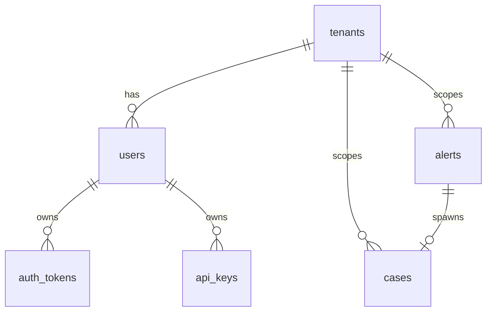

---

## 11. HTTP API reference

Base URL prefix: **`/api/v1`** (except health/metrics on root).

| Method | Path | Auth | Purpose |
|--------|------|------|---------|
| GET | `/health` | none | Liveness |
| GET | `/ready` | none | Artifact checks |
| GET | `/metrics` | none | Prometheus text |
| POST | `/api/v1/auth/login` | none | Access + refresh tokens |
| POST | `/api/v1/auth/refresh` | none | Rotate tokens |
| POST | `/api/v1/auth/logout` | bearer | Revoke access token |
| POST | `/api/v1/auth/revoke-all` | bearer | Revoke all tokens for user |
| GET | `/api/v1/auth/me` | bearer or api key | Current user |
| POST/GET/DELETE | `/api/v1/auth/api-keys` | analyst+ | API key management |
| GET/PATCH | `/api/v1/settings/detection` | viewer+ / analyst+ | Detection settings |
| POST | `/api/v1/detections/score` | analyst+ | Batch scoring API |
| POST | `/api/v1/detections/triage` | analyst+ | Fusion triage API |
| POST | `/api/v1/detections/explain` | analyst+ | Linear top-feature explain JSON for one row |
| POST | `/api/v1/detections/stream-session` | analyst+ | Timed Zeek job |
| POST | `/api/v1/llm/format-explanation` | analyst+ | Optional LLM prose from explain JSON (server env) |
| CRUD | `/api/v1/alerts`, `/cases`, … | RBAC | SOC entities |
| GET | `/api/v1/jobs/{id}` | RBAC | Job status (SQLite) |
| GET | `/api/v1/jobs/{id}/stream-summary` | RBAC | JSON summary after `stream_collect` completes |
| GET | `/api/v1/jobs/{id}/scored-preview` | RBAC | Last N rows (limit≤500) from stream job Parquet |
| WS | `/api/v1/ws/events` | token query | Live events |

> **OpenAPI**: available at `/docs` and `/openapi.json` when the server runs.

---

## 12. Pydantic request/response schemas

Defined in [`src/hawk_eye/backend/schemas.py`](src/hawk_eye/backend/schemas.py), including:

- `LoginRequest`, `LogoutRequest`, `RefreshRequest`, `ApiKeyCreate`, `ExportJobCreate`
- `TenantCreate`, `AlertCreate`, `AlertStatusUpdate`, `CaseCreate`, `CaseUpdate`, `CaseCommentCreate`, `CaseAssignCreate`
- `RuleCreate`, `SuppressionCreate`, `ScoreRequest`, `ExplainRowRequest`, `LlmFormatExplanationRequest`, `DetectionSettingsPatch`, `StreamSessionCreate`

Each model documents JSON field types and optional defaults for machine-generated OpenAPI clients.

---

## 13. Results, metrics & interpretation

- **Multiclass**: prefer **macro-F1**, per-class recall on **rare** families, not accuracy alone (class imbalance).
- **Anomaly**: **FPR on benign** vs **TPR on attacks**; tune thresholds on validation benign.
- **Fusion outputs**: inspect `decision_label` distribution and `reason_codes` for debugging threshold changes.
- **Reports/** JSON files (e.g. `final_rare_scorecard.json`, `kpi_gate.json`) capture **point-in-time** run outcomes — regenerate after retraining.

---

## 14. Quickstart (condensed)

```bash
python3 -m venv .venv
source .venv/bin/activate
pip install -r requirements.txt
pip install -e ".[dev]"
pytest -q
```

**Full ML pipeline (example):** see [Appendix](#appendix-dataset--pipeline-commands-cicids) and [`docs/data.md`](docs/data.md) for Kaggle dataset pins.

**API server:**

```bash
./scripts/run_api_service.sh
# health: GET http://127.0.0.1:8000/health
```

**Seeded admin (first DB init):** username `admin`, password `admin123` — **change in production**.

### Scoring (predictions + probabilities)

```bash
python3 -m hawk_eye.score --input data/processed/val.csv --output scored.parquet \
  --predictions --proba-all --proba-max
```

**SOC-style queue labels** (recommendations only — not automatic enforcement):

```bash
python3 -m hawk_eye.soc_policy --input scored.parquet --output soc_scored.parquet \
  --block-min-proba 0.92
```

See [`docs/runbook.md`](docs/runbook.md) for `HAWK_EYE_MODEL_DIR`, bundle rollback, and SOC caveats.

### Anomaly / novelty detection (benign-only)

After you have `data/processed/train.csv` (and val/test), export benign rows and train an **Isolation Forest** anomaly bundle:

```bash
./scripts/run_anomaly_pipeline.sh
```

See [`docs/anomaly.md`](docs/anomaly.md). Anomaly bundles use `HAWK_EYE_ANOMALY_DIR` or `artifacts/current_anomaly` (separate from supervised `HAWK_EYE_MODEL_DIR`). Optional fusion: [`scripts/fuse_scores.py`](scripts/fuse_scores.py).

**Novel / zero-day–style label:** combine supervised + anomaly with [`hawk_eye.detect_novel`](src/hawk_eye/detect_novel.py) (default label `Suspected_ZeroDay` when rules match — operational suspicion, not a verified zero-day or CVE). **Automated pipeline:** [`scripts/run_novel_pipeline.sh`](scripts/run_novel_pipeline.sh). Tuning guide: [`docs/novel_tuning.md`](docs/novel_tuning.md).

**Attack but not “like known” (triage):** [`hawk_eye.detect_attack_uncertain`](src/hawk_eye/detect_attack_uncertain.py) needs a **binary** bundle (`--binary-dir` / `HAWK_EYE_BINARY_DIR`) plus the same multiclass + anomaly bundles; it adds `is_attack_uncertain` when binary predicts Attack and (novelty heuristic **or** high `suspected_zero_day_pct`). Helper: [`scripts/run_attack_uncertain.sh`](scripts/run_attack_uncertain.sh).

### Before scoring live exports

Validate the feature schema against your bundle:

```bash
python3 scripts/validate_feature_schema.py --input your_flows.csv --model-dir artifacts/current
```

Drift check (reference vs new sample):

```bash
python3 scripts/compare_feature_stats.py --reference data/processed/train.csv --sample your_flows.csv
```

---

## 15. Deep usage guide (install → API → dashboard → lab)

This section is a **step-by-step path** for running Hawk-Eye locally: Python environment, model bundles, FastAPI backend, React dashboard, synthetic lab traffic, and optional Zeek. For shorter student-oriented steps, see [`docs/STUDENT_QUICKSTART.md`](docs/STUDENT_QUICKSTART.md) and [`docs/STUDENT_LAB.md`](docs/STUDENT_LAB.md).

### 15.1 Prerequisites

| Requirement | Notes |
|-------------|--------|
| **Python** | 3.11+ (see `pyproject.toml` `requires-python`). |
| **Node.js** | 18+ for the dashboard (`dashboard/frontend`). |
| **Git** | Clone and update the repo. |
| **Optional: Zeek** | Only if you use **live** `conn.log` capture (not required for synthetic lab). |
| **Optional: Kaggle API** | Only for full CICIDS download pipelines (see Appendix). |

### 15.2 Clone and Python environment

From the repository root:

```bash
git clone <your-fork-or-upstream-url> Hawk-Eye
cd Hawk-Eye
python3 -m venv .venv
source .venv/bin/activate   # Windows: .venv\Scripts\activate
pip install -U pip
pip install -e ".[dev]"
```

Verify imports:

```bash
PYTHONPATH=src python3 -c "import hawk_eye; print('ok')"
pytest -q tests/test_lab_simulation.py
```

### 15.3 Model bundles (required for meaningful scores)

The API and **Model lab** need **bundles** under `artifacts/` (supervised, optional anomaly/binary). For a **minimal smoke** setup (small, fast CI-style bundles):

```bash
python scripts/ci_build_minimal_bundles.py
```

That produces versioned directories under `artifacts/hawk-eye-*` and symlinks such as `artifacts/current`. For **real** multiclass behavior (e.g. attack-family names), train on your data with `hawk_eye.train` or the CICIDS scripts (Appendix). The backend resolves bundles via **detection settings**, env vars (`HAWK_EYE_MODEL_DIR`, etc.), and defaults documented in [`docs/OPERATOR_GUIDE_LOCAL.md`](docs/OPERATOR_GUIDE_LOCAL.md).

### 15.4 Start the FastAPI backend

The dashboard expects the API on the host/port your Vite proxy uses (typically **127.0.0.1:8000**). From the repo root:

```bash
./scripts/run_api_8000.sh
```

This script sets **`HAWK_EYE_CORS_ORIGINS`** for Vite dev ports (5173/5174) and optionally **`HAWK_EYE_DEFAULT_CONN_LOG`** if `data/live/conn.log` or `data/lab/sim_conn.log` exists. Health checks:

- `GET http://127.0.0.1:8000/health` — process up  
- `GET http://127.0.0.1:8000/ready` — bundles / readiness for scoring  

OpenAPI: `http://127.0.0.1:8000/docs`

First-time SQLite DB is created under `data/db/` (gitignored); a default **admin** user may be seeded — see [`SECURITY.md`](SECURITY.md) or operator docs for local passwords.

### 15.5 Start the React dashboard

```bash
cd dashboard/frontend
npm install
npm run dev
```

Open **http://localhost:5173** (or the URL Vite prints). The dev server **proxies** `/api` to the backend (see `dashboard/frontend/vite.config.ts`), so the browser calls same-origin paths like `/api/v1/...`.

**Routes (high level):**

| Path | Purpose |
|------|---------|
| `/login` | Bearer login or API key mode. |
| `/start` | Student “Start here” checklist (Ops, Model lab, Live stream). |
| `/` | **Model lab** — paste JSON rows, Score / Triage, Explain, optional LLM formatting. |
| `/stream` | **Live stream** — timed window over a `conn.log` path on the API host. |
| `/ops` | Health / readiness JSON. |
| `/settings` | Detection settings (poll intervals, paths, fusion profile). |

Optional: **`VITE_STUDENT_LAYOUT=true`** or the sidebar **“Simpler navigation”** toggle reduces SOC-style nav noise (see `layoutConfig.ts`).

### 15.6 Model lab (batch scoring in the UI)

1. Log in (local dev defaults are documented on the login page in **DEV** builds only).  
2. On **Model lab**, paste a **JSON array of row objects** (flow features your bundle expects) or upload a small JSON/JSONL file.  
3. Click **Score** or **Triage**. **Triage** runs fusion (`decision_label`: `KnownAttack` / `AttackUncertain` / `BenignOrLowRisk`).  
4. Use **Explain** for linear top features (per row index), then optional **LLM narrative** if the API has `OPENAI_API_KEY` (otherwise stub).  

Raw API equivalents: `POST /api/v1/detections/score`, `POST /api/v1/detections/triage`, `POST /api/v1/detections/explain`, `POST /api/v1/llm/format-explanation` (see §11).

### 15.7 Synthetic lab traffic (no Zeek required)

For classrooms, generate **fake** Zeek-style `conn.log` lines (authorized lab use only):

```bash
# Short preset
python3 scripts/lab_simulate_conn_log.py --out data/lab/sim_conn.log --scenario mixed --lines 80

# Rich phased scenario (normal + many synthetic “shapes”)
python3 scripts/lab_simulate_conn_log.py \
  --scenario-file lab_scenarios/classroom_full_menu.json \
  --out data/lab/sim_conn.log --seed 42
```

**Profile meanings and teaching narratives:** [`docs/LAB_SYNTHETIC_PROFILES.md`](docs/LAB_SYNTHETIC_PROFILES.md).  
**While Live stream runs**, append more lines or use **`--daemon`** (see `scripts/lab_simulate_conn_log.py --help`).

### 15.8 Live stream (timed Zeek window)

1. Ensure the API can read **`conn_log_path`** — same machine as the API (browser does not read your NIC).  
2. Open **Live stream**, set duration (e.g. `1m`), confirm path (or env default).  
3. **Start streaming**; wait until the job is **completed**.  
4. Read **verdict**, **decision counts**, **known attack types** (multiclass names on `KnownAttack` rows), preview table, optional **incident report**.  

API: `POST /api/v1/detections/stream-session`, then `GET /api/v1/jobs/{id}/stream-summary` and scored preview endpoints (§11).

### 15.9 Optional: real Zeek capture

On the API host, authorized capture can write `data/live/conn.log` (see [`docs/OPERATOR_GUIDE_LOCAL.md`](docs/OPERATOR_GUIDE_LOCAL.md), `scripts/zeek_network_capture.sh`). Point **Detection settings** or Live stream at that path.

### 15.10 Environment variables (common)

| Variable | Role |
|----------|------|
| `HAWK_EYE_CORS_ORIGINS` | Comma-separated origins allowed for browser calls (set by `run_api_8000.sh` for Vite). |
| `HAWK_EYE_DEFAULT_CONN_LOG` | Fallback path to `conn.log` when UI does not set one. |
| `HAWK_EYE_MODEL_DIR` / `HAWK_EYE_ANOMALY_DIR` / `HAWK_EYE_BINARY_DIR` | Override bundle directories for scoring (see `docs/runbook.md`). |
| `OPENAI_API_KEY` | Optional server-side LLM for incident narrative / explanation formatting. |

### 15.11 Tests

```bash
# Python (from repo root, venv active)
pytest -q

# Dashboard E2E (requires API + frontend; see dashboard/frontend/playwright.config.ts)
cd dashboard/frontend && npm run test:e2e
```

### 15.12 Troubleshooting

- **CORS / cannot reach API:** Backend must run; Vite proxy target must match; see [`docs/OPERATOR_GUIDE_LOCAL.md`](docs/OPERATOR_GUIDE_LOCAL.md).  
- **Bundles not ready:** `GET /ready`, **Ops / health** in UI, build bundles (§15.3).  
- **Stream hints 404:** API/backend version mismatch — restart API from this repository.  
- **Student / lab flow:** [`docs/STUDENT_LAB.md`](docs/STUDENT_LAB.md) troubleshooting table.  

---

## 16. Further reading

| Document | Topics |
|----------|--------|
| [`docs/OPERATOR_GUIDE_LOCAL.md`](docs/OPERATOR_GUIDE_LOCAL.md) | Canonical local run, dual detection, API settings, stream jobs |
| [`docs/MODEL_GOVERNANCE.md`](docs/MODEL_GOVERNANCE.md) | Governance expectations |
| [`docs/anomaly.md`](docs/anomaly.md) | Anomaly vs supervised, when to fuse |
| [`docs/binary_benign_attack.md`](docs/binary_benign_attack.md) | Binary training mode |
| [`docs/novel_tuning.md`](docs/novel_tuning.md) | Novelty pipeline tuning |
| [`docs/RELEASE_CHECKLIST.md`](docs/RELEASE_CHECKLIST.md) | Release discipline |


---


---

## Appendix: Dataset & pipeline commands (CICIDS)

Pinned dataset: **`dhoogla/cicids2017`** (see [`docs/data.md`](docs/data.md)).

1. Create `~/.kaggle/kaggle.json` via Kaggle Account → API → Create New API Token, then `chmod 600 ~/.kaggle/kaggle.json`.
2. **Full pipeline** (download → splits → train → evaluate → `artifacts/current` symlink):

```bash
source .venv/bin/activate
pip install -e .
# Optional: LightGBM / XGBoost / ensemble training
# pip install -e ".[benchmark]"
./scripts/run_cicids_pipeline.sh
```

Optional: `MAX_ROWS=500000` (default `200000`) caps rows for faster iteration; increase or set very high for full data if you have RAM.

### Train without Kaggle (sanity check)

```bash
./scripts/demo_train_without_kaggle.sh
```

### Train on `kaggleData/` (Parquet in repo)

Place Kaggle Parquet files under `kaggleData/`, then:

```bash
./scripts/pipeline_kaggle_data.sh
```

**Sklearn** pipeline writes `reports/metrics_val_kaggle.json`. Default `MAX_ROWS` matches the PyTorch script (`400000`); set the same `MAX_ROWS` when comparing runs (see [`docs/evaluation.md`](docs/evaluation.md)).

### PyTorch MLP on `kaggleData/`

```bash
./scripts/pipeline_kaggle_torch.sh
```

Writes `reports/metrics_val_kaggle_torch.json` and symlinks `artifacts/current` to the new torch bundle.

### Stronger sklearn accuracy (CICIDS tabular)

Logistic regression is the default. For **often higher accuracy** on the same numeric features (closer to many GBDT paper baselines, still not “every SOTA”):

```bash
python3 -m hawk_eye.train --data data/processed/train.csv --out artifacts/hawk-eye-hgb \
  --label-col Label --model-type hist_gradient_boosting --logistic-balanced
```

`config.json` records `sklearn_model_type`. Tune with validation F1 / macro-F1 via `hawk_eye.evaluate`.

**Binary (Benign vs Attack):** [`docs/binary_benign_attack.md`](docs/binary_benign_attack.md) — `--binary-benign-vs-attack` with `--benign-label` (collapses all attack families to `Attack`).

**Calibration:** `python3 -m hawk_eye.train ... --calibration-data data/processed/val.csv --calibration-method sigmoid`

**Open-set distances (optional):** add `--save-open-set-prototypes` at train, then `python3 -m hawk_eye.open_set --input val.csv --output with_open_set.parquet`

**Utilities:** `scripts/hparam_search_supervised.py`, `scripts/select_thresholds.py`, `scripts/build_splits_time.py`, `scripts/eval_leave_family_out.py`, `scripts/perturbation_sanity.py`

### Lab / live capture

Authorized testing only: [`docs/lab.md`](docs/lab.md). **End-to-end PCAP → CIC flows → score:** [`docs/cic_live_pipeline.md`](docs/cic_live_pipeline.md) (CICFlowMeter, `normalize_flow_csv.py`, `run_live_pipeline.sh`).

**Class imbalance:** use `hawk_eye.train --logistic-balanced`, `print_class_balance.py`, and `evaluate --summary` / `summarize_rare_metrics.py` (see `docs/cic_live_pipeline.md`).

### Local go-live bundle

- Operator guide: [`docs/OPERATOR_GUIDE_LOCAL.md`](docs/OPERATOR_GUIDE_LOCAL.md)
- Model governance: [`docs/MODEL_GOVERNANCE.md`](docs/MODEL_GOVERNANCE.md)
- Release checklist: [`docs/RELEASE_CHECKLIST.md`](docs/RELEASE_CHECKLIST.md)
- Canonical run: `./scripts/run_canonical_local.sh`

### Model bundles

Training writes a versioned model bundle directory under `artifacts/` containing the model, preprocessor, feature contract, and metadata.

Scoring resolves the bundle via:

- `--model-dir` (highest priority)
- `HAWK_EYE_MODEL_DIR`
- `./artifacts/current`

CI runs `pytest` on push (see [`.github/workflows/ci.yml`](.github/workflows/ci.yml) if present).

---

<div align="center">

**End of Hawk-Eye comprehensive README**

*For file-specific questions, use this document’s §4 encyclopedia and cross-linked source files.*

</div>
